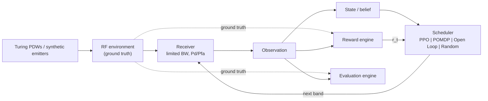

# SMARTSCAN

**Adaptive RF Spectrum Scanning & Interception Research Platform** — SIH 2026, Problem Statement 26055:
*Smart Scan Strategy for Electronic Warfare in the absence of prior reliable intelligence of emitters.*

Research simulation prototype: Python · Gymnasium · Stable-Baselines3 (PPO) · PyTorch · Streamlit · Plotly.

## Problem

A receiver must monitor a wide spectrum, but its instantaneous bandwidth is limited: it can inspect only one band
per dwell. **Every scan decision changes what information becomes available next.** The question is not "which
frequency contains a signal?" but *"given everything observed so far, which band should the receiver scan next?"*
That makes this a sequential decision problem.

## Example

```
Spectrum    F1   F2   F3   F4   F5   F6   F7   F8        (1.0 … 1.7 GHz, one band per dwell)
Open loop   F1 → F2 → F3 → F4 → F5 → F6 → F7 → F8 → …    fixed order, ignores observations
Threat      short transmission on F6 while the sweep is at F2 → may be gone before F6 is visited
```

## Solution

```
observations → state / belief → policy π(a|s) → select next band → receiver observes → reward → learn
```

SmartScan builds an explicit RF environment with hidden ground truth, a limited-bandwidth receiver, a Gymnasium
environment, four interchangeable scan schedulers, and one evaluation engine that scores them all under identical
conditions.

## Architecture


Ground truth (dashed) reaches only the reward and evaluation engines. Details: [docs/02_system_architecture.md](docs/02_system_architecture.md).

## Why Reinforcement Learning

The value of scanning a band now depends on what will be observable later: when a periodic emitter will be on again,
whether an agile emitter has hopped, whether an unseen band hides a new emitter. PPO learns this trade-off between
exploration and exploitation from interaction instead of hand-set weights. The original POMDP heuristic stays in the
project as a baseline.

## State

`11·N + 3` features in [0, 1], built **only** from receiver-observable history: per band a Bayesian activity belief,
uncertainty, staleness, detection ratio, detection EMA, scan share, estimated period, periodic "due" score, time since
detection, and last amplitude; a one-hot previous action; and episode progress, coverage, and last-dwell detection.
Ground truth and the reward are excluded. See [docs/05](docs/05_rl_formulation.md).

## Action

`a_t ∈ {0, …, N−1}`: the band the receiver tunes to next. The receiver really dwells there; nothing else is observed.

## Reward

```
R_t = w_d·D + w_i·I − w_f·F − w_m·M − w_s·S − w_l·L − w_v·V
```
D = true detections, I = transmissions intercepted for the first time, F = false alarms, M = missed detections,
S = retune, L = fraction of emitters with an active, un-intercepted transmission, V = empty re-scans. All weights are
configurable. The reason for each term is in [docs/06](docs/06_reward_function.md).

## PPO

Stable-Baselines3 `PPO("MlpPolicy")`, [128, 128], 8 parallel environments, trained on seeds 1–100, model selection on
validation seeds 501–520, reporting on unseen test seeds 1001–1100. The run saves checkpoints, TensorBoard logs,
`best_model.zip`, `final_model.zip`, the config and metadata. See [docs/07](docs/07_ppo_training.md).

## Baselines

Open Loop (cyclic sweep), Random (uniform), POMDP (the project's original belief-state scheduler, algorithm unchanged).
All implement `BaseScheduler` and run through the same `SmartScanEnv`.

## Turing Dataset

The Alan Turing Institute's Turing Synthetic Radar Dataset (PDWs: ToA, CF, PW, AoA, amplitude, emitter labels) is
used as an optional **ground-truth source** (Mode B, stare mode) and explored in the Dataset Explorer with bounded,
strided reads. It is not the scheduling solution itself. Without the dataset the app runs on the synthetic environment
and says so. See [docs/10](docs/10_turing_dataset.md).

## Metrics

Pd, Pfa, interception rate (per transmission), average intercept time (per emitter), intercept time error (relative to
transmission onset), normalised delay, emitter discovery rate, detection / miss / false-alarm counts, hit rate,
scan coverage, band revisit frequency, cumulative and average reward. All are reported as mean ± std over episodes
with n. Definitions are in [docs/09](docs/09_evaluation_methodology.md).

## Installation

```
python -m venv .venv
.venv\Scripts\activate                 # Windows   (source .venv/bin/activate on Linux/macOS)
pip install -r requirements.txt
```

## Running

```
streamlit run app.py                   # http://localhost:8501
```
Pages: Overview · Scenario Builder · Live Simulation (START / PAUSE / STEP / RUN 10 / RUN 100 / RESET) · RL Training ·
Policy Evaluation · Algorithm Comparison · Analytics · Dataset Explorer · Methodology.

## Training PPO

```
python -m smartscan.rl.train --config configs/default.yaml
python -m smartscan.rl.train --config configs/default.yaml --timesteps 1000000 --seed 7 --out models/ppo_long
```

## Evaluation

```
python -m smartscan.rl.evaluate --model models/ppo_mixed_8band/best_model.zip                 # unseen test seeds
python -m smartscan.rl.evaluate --model models/ppo_mixed_8band/best_model.zip --split train   # training seeds
```

## Algorithm Comparison

```
python -m smartscan.evaluation.comparison --config configs/default.yaml --split test --episodes 100
```
Prints mean ± std per scheduler and paired differences against Open Loop with 95 % CIs, and saves
`experiments/results/<timestamp>_<scenario>_<split>/` (config.json, metrics.json, per_episode.csv, summary.csv,
comparison_table.csv, decisions.csv). No result is hard-coded anywhere; run the command to reproduce.

## Project Structure

```
app.py                      Streamlit entry point
configs/                    experiment presets (default, sih_example, wideband_32, turing)
smartscan/
  config.py                 typed configuration + YAML/JSON I/O
  environment/              emitter.py, scenario.py, turing.py, reward.py, smartscan_env.py
  receiver/                 detector.py, receiver.py, observation.py
  schedulers/               base.py, open_loop.py, random_scan.py, pomdp.py, ppo.py
  rl/                       train.py, evaluate.py, callbacks.py
  evaluation/               metrics.py, experiment.py, comparison.py, live.py
  visualization/            style.py (MATLAB-like), spectrum, trajectory, belief, reward, comparison, dataset
  ui/                       one module per page
models/                     trained PPO models
experiments/results/        saved experiments
tests/                      pytest suite
docs/                       documentation (01–14) + original ARD and guide
```

## Documentation

[01 Problem](docs/01_problem_statement.md) · [02 Architecture](docs/02_system_architecture.md) ·
[03 RF environment](docs/03_rf_environment.md) · [04 Receiver](docs/04_receiver_model.md) ·
[05 RL formulation](docs/05_rl_formulation.md) · [06 Reward](docs/06_reward_function.md) ·
[07 PPO training](docs/07_ppo_training.md) · [08 Baselines](docs/08_baseline_algorithms.md) ·
[09 Evaluation](docs/09_evaluation_methodology.md) · [10 Turing dataset](docs/10_turing_dataset.md) ·
[11 User guide](docs/11_user_guide.md) · [12 Developer guide](docs/12_developer_guide.md) ·
[13 Limitations](docs/13_limitations.md) · [14 Demo script](docs/14_demo_script.md)

## Limitations

Simulation only: simplified emitter and detector models, binary per-band detection, and discrete time. PPO is tied
to the scenario family and to N, and its reward needs simulator ground truth. The POMDP baseline is a heuristic, not
an optimal solver. See [docs/13](docs/13_limitations.md). This is a research prototype, not an operational EW system,
and makes no field-validation claims.

## Reproducibility

Every random quantity derives from a seed: the scenario seed sets the emitters and the receiver noise (common random
numbers across schedulers), `ppo.seed` sets training, and the scheduler seed is derived from the scenario seed.
Every model and result folder stores its exact `config.json`. Run the test suite with `python -m pytest -q`.
