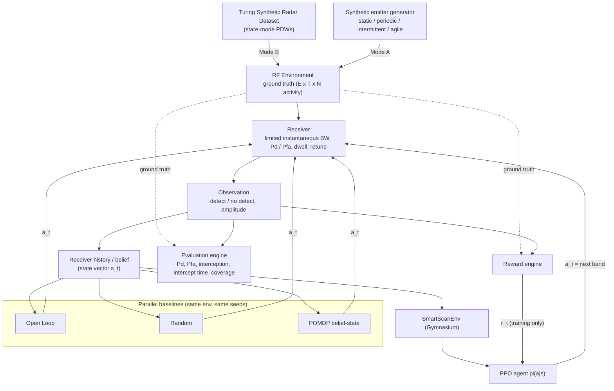

# 02 — System Architecture



Dashed arrows carry ground truth. They end at the reward and evaluation engines and never at a scheduler.

## Package layout

| Module | Responsibility |
|---|---|
| `smartscan/config.py` | Typed `ExperimentConfig` (scenario, receiver, reward, observation, PPO, seed splits), YAML/JSON I/O |
| `smartscan/environment/emitter.py` | Emitter behaviour models → per-seed band traces |
| `smartscan/environment/scenario.py` | Scenario realisation, ground-truth activity, transmission segmentation |
| `smartscan/environment/turing.py` | Turing dataset discovery, bounded/strided PDW reads, Mode-B scenario builder |
| `smartscan/environment/reward.py` | Reward equation |
| `smartscan/environment/smartscan_env.py` | Gymnasium env used by PPO **and** by every baseline |
| `smartscan/receiver/` | Detector models, receiver dwell, receiver-side history and state vector |
| `smartscan/schedulers/` | `BaseScheduler` + Open Loop, Random, POMDP, PPO |
| `smartscan/rl/` | Training, evaluation CLI, callbacks |
| `smartscan/evaluation/` | Metrics, multi-seed runner, comparison CLI, step-by-step engine |
| `smartscan/visualization/` | Plotly figures (MATLAB-like style) |
| `smartscan/ui/` + `app.py` | Streamlit engineering console |

## One decision (identical for every scheduler)

```
ctx    = DecisionContext(state vector, receiver history, t)
a_t    = scheduler.select_action(ctx)
obs, r = SmartScanEnv.step(a_t)        # receiver dwells on a_t; reward/metrics from ground truth
scheduler.update(a_t, obs)
```
